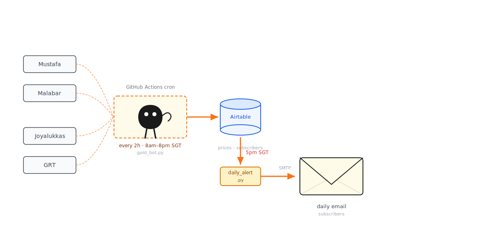
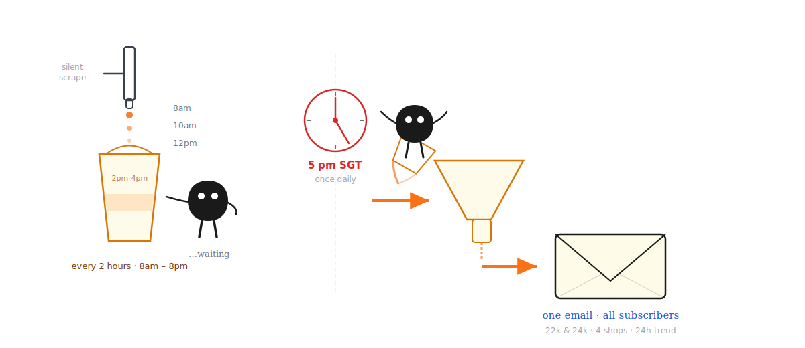

# Gold Notifier SG

[](https://nextjs.org)
[](https://www.typescriptlang.org)
[](https://vercel.com)
[](https://python.org)
[](https://github.com/features/actions)
[](https://airtable.com)

> Free, automated gold price monitoring for Singapore. Get one daily email comparing 22k and 24k prices across 4 major jewellers, with 24-hour average trends.
>
> **Website:** [www.goldnotifier.com](https://www.goldnotifier.com) · **Contact:** alerts@goldnotifier.com

---

## Demo

[](https://youtu.be/u0Ga1t7mMMA?feature=shared)

---

## The Problem It Solves

Gold prices in Singapore change daily and vary across shops — Mustafa, Malabar, Joyalukkas, GRT. Checking all four manually to find the best time to buy is tedious and easy to forget.


<!--
ILLUSTRATION 1 — Before/After contrast
Place: here, after "The Problem It Solves"

Prompt:
Generate one standalone 16:9 horizontal article illustration.

Visual DNA:
Pure white background. Minimalist black hand-drawn line art. Slightly wobbly pen lines. Lots of empty white space. Sparse handwritten English annotations. Clean absurd product-sketch feeling. No gradients, no shadows, no paper texture, no complex background, no commercial vector style, no PPT infographic look.

Recurring IP character required:
小黑, a small solid-black absurd creature with white dot eyes, tiny thin legs, blank serious expression, slightly uneven hand-drawn body shape. 小黑 must perform the core conceptual action, not decorate the scene.

Theme: The exhausting manual way vs the calm automated way.

Structure type: Before/After contrast.

Core idea: Left side — chaos of checking multiple shop websites; right side — one clean email, decision made.

Composition:
Left half: 小黑 buried under a pile of floating price tags from 4 different shops, arms flailing, overwhelmed. Hand-drawn tags scattering everywhere.
Orange arrow pointing right to the right half.
Right half: 小黑 sitting calmly, holding one small envelope, single price card visible. Relaxed posture, deadpan expression.

Suggested elements: price tag pile / envelope / arrow / minimal shop names as floating labels.

English handwritten labels:
"check 4 sites" / "every day??" / "→" / "one email" / "done"

Color use:
Black for main line art and 小黑. Orange for the central transition arrow. Red for the price tag chaos on the left. Blue for the calm envelope on the right.

Constraints:
One image explains only one core structure. Keep the main subject around 40-60% of the canvas. Preserve at least 35% blank white space. Use at most 5-8 short labels. Do not write a title in the top-left corner. Not a formal diagram. Strange but clean.
-->


Gold Notifier automates the whole loop — scrape, compare, email — so you only need to check your inbox once a day.

---

## How It Works

<!--
ILLUSTRATION 2 — System workflow
Place: here, under "How It Works"

Prompt:
Generate one standalone 16:9 horizontal article illustration.

Visual DNA:
Pure white background. Minimalist black hand-drawn line art. Slightly wobbly pen lines. Lots of empty white space. Sparse handwritten English annotations. Clean absurd product-sketch feeling. No gradients, no shadows, no paper texture, no complex background, no commercial vector style, no PPT infographic look.

Recurring IP character required:
小黑, a small solid-black absurd creature with white dot eyes, tiny thin legs, blank serious expression, slightly uneven hand-drawn body shape. 小黑 must perform the core conceptual action, not decorate the scene.

Theme: The full automated pipeline from shops to subscriber inbox.

Structure type: Workflow — input → process → output.

Core idea: 4 shop websites are scraped by a machine, prices are stored, and once a day one tidy email goes out to subscribers.

Composition:
Far left: four small hand-drawn shop storefronts in a loose column, labelled.
Orange arrows pointing right into a strange hand-drawn machine in the center. 小黑 is inside the machine turning a crank, deadpan.
Two outputs come out of the machine going right: a small cylinder (Airtable database) and a small clock/calendar.
At 5pm the clock triggers a final orange arrow to a floating envelope on the far right labelled "daily email".

Suggested elements: shop storefronts / weird crank machine / database cylinder / clock / envelope.

English handwritten labels:
"Mustafa" / "Malabar" / "Joyalukkas" / "GRT" / "every 2h" / "5pm SGT" / "your inbox"

Color use:
Black for main line art and 小黑. Orange for all flow arrows and main paths. Blue for the database cylinder. Red only for the clock trigger moment.

Constraints:
One image explains only one core structure. Keep the main subject around 40-60% of the canvas. Preserve at least 35% blank white space. At most 7 short labels. No title in top-left corner. Not a formal flowchart or system architecture diagram. Invent a fresh machine metaphor — do not reuse conveyor belts or prior compositions.
-->



**Every 2 hours (8am–8pm SGT):** `gold_bot.py` scrapes live prices from all 4 jewellers and writes them to Airtable. No email is sent.

**Once daily at 5pm SGT:** `daily_alert.py` reads the last 24 hours of prices, calculates the trend, and sends one email to every subscriber.

```
GitHub Actions (cron)           goldnotifier.com/trigger (phone)
       │                                   │
       ▼                                   ▼
 gold_bot.py ── scrape ──► Mustafa · Malabar · Joyalukkas · GRT
       │
       └── read/write ──► Airtable (subscribers · prices · history)

Daily at 5pm SGT
       │
       ▼
 daily_alert.py ──► Airtable ──► Namecheap SMTP ──► Subscribers

Next.js / Vercel  (goldnotifier.com)
  └── API routes ──► Airtable
        ├── /api/subscribe
        ├── /api/unsubscribe/*  (OTP flow)
        ├── /api/metrics
        ├── /api/visitors
        └── /api/trigger        (dispatch workflow from phone)
```

---

## What You Get in the Email

<!--
ILLUSTRATION 3 — Schedule / rhythm
Place: here, after "What You Get in the Email" heading

Prompt:
Generate one standalone 16:9 horizontal article illustration.

Visual DNA:
Pure white background. Minimalist black hand-drawn line art. Slightly wobbly pen lines. Lots of empty white space. Sparse handwritten English annotations. Clean absurd product-sketch feeling. No gradients, no shadows, no paper texture, no complex background, no commercial vector style, no PPT infographic look.

Recurring IP character required:
小黑, a small solid-black absurd creature with white dot eyes, tiny thin legs, blank serious expression, slightly uneven hand-drawn body shape. 小黑 must perform the core conceptual action, not decorate the scene.

Theme: Silent data collection all day, then one decisive delivery at 5pm.

Structure type: Conceptual metaphor.

Core idea: 小黑 quietly fills a bucket with data points all day (each drip = one scrape), then at 5pm tips the full bucket into a funnel that produces a single neat envelope.

Composition:
Left side: a tall narrow bucket. A dripping tap above it with very thin orange drips falling in. Small clock-like marks beside the drips showing "every 2h". 小黑 stands beside the bucket watching it fill, arms at sides, expressionless.
Right side: at 5pm mark, 小黑 tips the bucket into a wide funnel. Out the funnel's narrow end comes one small envelope with an orange arrow pointing to the right edge of the canvas.
The funnel is slightly strange/wobbly looking.

Suggested elements: dripping tap / bucket / funnel / envelope / time marks.

English handwritten labels:
"every 2h" / "8am–8pm" / "silent" / "5pm" / "→ inbox"

Color use:
Black for main line art and 小黑. Orange for drips, the tipping action, and the final arrow. Blue only for the bucket fill level. Red for the "5pm" moment.

Constraints:
One image, one idea. Preserve at least 35% white space. At most 5 short labels. No title in top-left corner. Strange but tidy. Do not copy prior funnel/conveyor/fish compositions.
-->



Each daily email contains:

1. **Current prices** across all 4 shops — 22k and 24k
2. **% change vs the 24-hour average** — so you see the day's trend, not just one snapshot
3. **A visual price history chart** across all shops

```
📊 Daily Gold Price Update (SGD)
As at 2026-03-28 17:00:00 SGT

=================================
🏪 Mustafa Jewellery
  22k (916): S$204.40  ↑ +0.3%
  24k (999): S$222.00  → 0.0%
  24h avg: 22k S$203.80  |  24k S$222.00
=================================
🏪 Malabar Gold SG
  22k (916): S$206.00  ↑ +0.5%
  24k (999): S$224.50  ↑ +0.2%
  24h avg: 22k S$204.95  |  24k S$224.00
=================================
...
```


---

## Architecture

### Data Collection Schedule

Two independent workflows handle scraping and alerting:

**Scraper — `goldrates.yml`** (no email, data only)
```yaml
"5 0,2,4,6,8,10,12 * * *"
# UTC 00:05–12:05 = SGT 08:05–20:05, every 2 hours
```

**Daily Alert — `daily_alert.yml`**
```yaml
"0 9 * * *"
# UTC 09:00 = SGT 17:00
```

### Target Shops

| Shop | Scrape Method | Notes |
|---|---|---|
| **Mustafa Jewellery** | HTML (requests) | `#22k_price1`, `#24k_price1` |
| **Malabar Gold SG** | HTML (requests) | `#price22kt_85`, `#price24kt_85` |
| **Joyalukkas SG** | GraphQL API | POST with `Store: "sg"` header |
| **GRT Jewels SG** | HTML (cloudscraper) | Cloudflare WAF bypass, regex extraction |

### Tech Stack

| Layer | Technology |
|---|---|
| **Frontend** | Next.js 14 App Router, TypeScript, pure CSS |
| **Hosting** | Vercel |
| **Scraper** | Python 3.11, requests, cloudscraper |
| **Database** | Airtable (subscribers, prices, history) |
| **Scheduler** | GitHub Actions (cron) |
| **Email** | Namecheap Private Email SMTP |

---

## Setup

### 1 — Clone

```bash
git clone https://github.com/unaveenj/Gold-Notifier-SG.git
cd Gold-Notifier-SG
```

### 2 — Web App (Next.js → Vercel)

```bash
cd web
npm install
cp .env.local.example .env.local
```

Fill in `.env.local`:
```
AIRTABLE_API_KEY=your_airtable_personal_access_token
AIRTABLE_BASE_ID=your_airtable_base_id
GITHUB_TOKEN=your_github_pat
TRIGGER_SECRET=your_trigger_secret
```

Run locally:
```bash
npm run dev   # http://localhost:3000
```

**Deploy to Vercel:** Import repo → set Root Directory to `web` → add env vars → deploy.

### 3 — Python Scraper

```bash
pip install -r requirements.txt
```

### 4 — Email (Namecheap SMTP)

Sent from `alerts@goldnotifier.com`:

| Setting | Value |
|---|---|
| Host | `mail.privateemail.com` |
| Port | `587` (STARTTLS) |
| Username | `alerts@goldnotifier.com` |

### 5 — GitHub Secrets

`Repo → Settings → Secrets → Actions`:

| Secret | Description |
|---|---|
| `AIRTABLE_API_KEY` | Airtable personal access token |
| `AIRTABLE_BASE_ID` | Airtable base ID |
| `EMAIL_USER` | `alerts@goldnotifier.com` |
| `EMAIL_PASSWORD` | Namecheap mailbox password |

---

## Frontend — Dark Luxury Gold UI

Built with Next.js 14 App Router, pure CSS, and Google Fonts. No UI library.

| Element | Choice |
|---|---|
| **Display font** | Cormorant Garamond (serif, editorial) |
| **Body font** | Outfit (modern, clean) |
| **Number font** | JetBrains Mono (monospaced) |
| **Gold accent** | `#c8a84b` — real 22k gold hue |
| **Background** | `#070708` near-black |
| **Motion** | Canvas particle system — 130 gold dust particles + 7 glow orbs |

### React Components

| Component | Purpose |
|---|---|
| **GoldBar3D** | Scroll-driven 3D CSS gold bar (−28° → +28° Y-rotation) |
| **GoldCanvas** | 130 gold dust particles + 7 ambient glow orbs |
| **SubscribeForm** | Email form with idle / loading / success / error / duplicate states |
| **LiveMetrics** | Live subscriber + alert counts, auto-refreshes every 30s |
| **VisitorBadge** | Session-based visitor counter |
| **RevealObserver** | Intersection observer for staggered scroll-reveal |
| **ScrollToFormButton** | Smooth scroll anchor to `#subscribe` |

---

## Reliability

- Max 3 retry attempts per scrape with exponential backoff (0.5s, 1s, 2s)
- 45-second total scrape deadline
- Numeric price validation — plausibility range check (80–600 SGD)
- Cloudscraper for Cloudflare-protected shops (GRT)
- Failure email sent even when scrape fails
- Duplicate subscription protection via Airtable dedup
- OTP-protected unsubscribe (6-digit code, 10-minute TTL)
- Fully serverless — no server to maintain

---

## SEO

- Schema.org JSON-LD — WebSite, Organization, Service, FAQPage
- Open Graph + Twitter Card — 1200×630 OG image generated server-side
- `robots.ts` / `sitemap.ts` via Next.js App Router
- SEO-critical sections rendered as server components for Googlebot
- Canonical URL: `https://www.goldnotifier.com`

---

## Project Structure

```
Gold-Notifier-SG/
├── web/                        ← Next.js app (deploy to Vercel)
│   ├── app/
│   │   ├── globals.css
│   │   ├── layout.tsx
│   │   ├── page.tsx
│   │   ├── components/
│   │   │   ├── GoldBar3D.tsx
│   │   │   ├── GoldCanvas.tsx
│   │   │   ├── SubscribeForm.tsx
│   │   │   ├── LiveMetrics.tsx
│   │   │   ├── VisitorBadge.tsx
│   │   │   └── RevealObserver.tsx
│   │   ├── unsubscribe/        ← OTP unsubscribe flow
│   │   ├── trigger/            ← Phone-friendly manual trigger
│   │   └── api/
│   │       ├── subscribe/
│   │       ├── metrics/
│   │       ├── visitors/
│   │       ├── unsubscribe/request/
│   │       ├── unsubscribe/confirm/
│   │       └── trigger/
│   └── package.json
├── scraper/
│   ├── gold_bot.py             ← Scraper + Airtable writer
│   └── price_tracker.py        ← Price change calculations
├── notifications/
│   ├── daily_alert.py          ← Daily 5pm email
│   ├── announcement.py         ← Manual broadcast
│   └── test_email.py
├── .github/workflows/
│   ├── goldrates.yml           ← Cron scraper (every 2h, 8am–8pm SGT)
│   ├── daily_alert.yml         ← Daily alert at 5pm SGT
│   ├── announcement.yml        ← Manual broadcast
│   └── test_email.yml
└── docs/
    ├── screenshots/
    └── illustrations/          ← Xiaohei illustrations (see prompts in README comments)
```

---

## Roadmap

- [x] Historical price chart in email
- [x] Price threshold alerts
- [x] Unsubscribe link in email footer
- [x] Multiple pricing sources — Mustafa, Malabar, Joyalukkas, GRT
- [x] Daily digest with 24h average comparison
- [x] Interactive 3D gold bar in hero
- [x] Full SEO — schema.org, OG image, sitemap, robots
- [x] Server/client component split for Googlebot indexing
- [x] Live metrics display (subscriber + alert counts)
- [x] Session-based visitor counter

---

## Disclaimer

Scrapes publicly available data for personal monitoring purposes only. Ensure compliance with each website's terms of service before deploying at scale.

---

## Featured Article

[You Can't Time the Gold Market — But You Can Still Buy Smart](https://medium.com/@unaveenj/you-cant-time-the-gold-market-but-you-can-still-buy-smart-7c9888cbfd63)

---

## Author

Built as a lightweight serverless automation to help Singapore gold buyers compare prices and time their purchases.

**Website:** [www.goldnotifier.com](https://www.goldnotifier.com)  
**Contact:** alerts@goldnotifier.com

⭐ Star this repo if you found it useful
