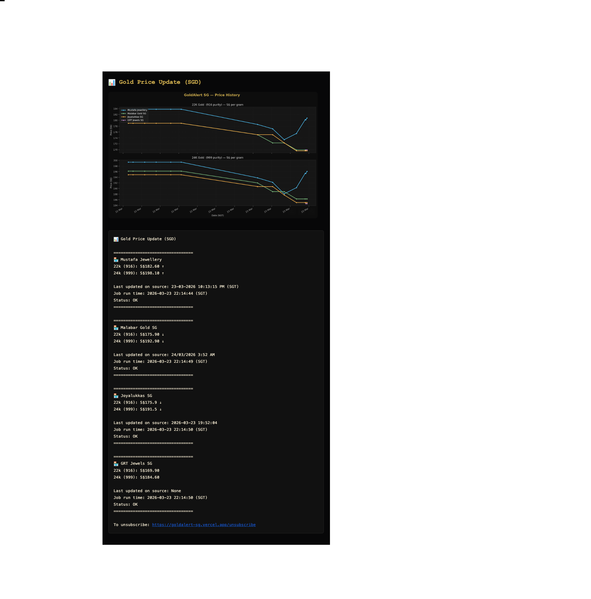

# 🪙 Gold Notifier — Gold Price Notifier

[](https://nextjs.org)
[](https://www.typescriptlang.org)
[](https://vercel.com)
[](https://python.org)
[](https://github.com/features/actions)
[](https://airtable.com)

> Free, automated gold price monitoring for Singapore. Get instant email alerts when 22k and 24k gold prices change at Mustafa Jewellery.
>
> **Website:** [www.goldnotifier.com](https://www.goldnotifier.com) · **Contact:** alerts@goldnotifier.com

---

## 🖥 Live UI


---

## ✨ What This Does

**Every 2 hours from 8am–8pm SGT**, the scraper silently collects live gold prices from 4 jewellers and saves them to Airtable — no email sent.

**Once a day at 5pm SGT**, a daily alert email is sent to all subscribers containing:
1. Current prices across all 4 shops (22k & 24k)
2. Percentage change vs the 24-hour average — so you see the day's trend, not just the last reading
3. A visual price history chart across all shops

Subscribers sign up via the **Next.js landing page** hosted on Vercel. Emails are stored in **Airtable**. Everything runs on **GitHub Actions** — fully serverless, zero infrastructure cost.

---

## 🏗 Architecture

```
GitHub Actions (cron / manual)        goldnotifier.com/trigger (phone)
        │                                        │
        ▼                                        ▼
  gold_bot.py  ──── scrape ────►  Mustafa · Malabar · Joyalukkas · GRT
        │
        ├── read/write ──► Airtable (subscribers · prices · history)
        │
        └── send email ──► Namecheap SMTP ──► Subscribers

Announcement Workflow (manual dispatch)
        │
        ▼
  announcement.py ──► Airtable (subscribers) ──► Namecheap SMTP ──► Subscribers

Next.js 14 / Vercel (goldnotifier.com)
  /subscribe · /unsubscribe · /metrics · /visitors · /trigger
        │
        └── read/write ──► Airtable
```

---

## 🎨 Frontend — Dark Luxury Gold UI

Built with **Next.js 14 App Router**, pure CSS, and Google Fonts. No UI library dependencies.

| Element | Choice |
|---|---|
| **Display font** | Cormorant Garamond (serif, editorial) |
| **Body font** | Outfit (modern, clean) |
| **Number font** | JetBrains Mono (monospaced, precise) |
| **Gold accent** | `#c8a84b` — real 22k gold hue |
| **Background** | `#070708` near-black |
| **Motion** | Canvas particle system (130 gold dust particles + 7 glow orbs) |

### Page Sections

1. **Announcement bar** — animated gold shimmer · "100% Free for Life — Limited Early Access"
2. **Hero** — live badge, Cormorant headline with shimmer animation, subscribe form, live metrics
3. **Stats band** — 2hr updates · 22k & 24k · 100% free
4. **Features** — 4 cards with gold border glow on hover
5. **Testimonials** — 2-column social proof cards
6. **How It Works** — 3-step process with connector lines
7. **Value Prop** — "Save up to S$350 per 100g" with gold shimmer
8. **CTA** — repeat subscribe form
9. **Footer**

---

## 📁 Project Structure

```
Gold-Notifier-SG/
├── web/                        ← Next.js app (deploy this to Vercel)
│   ├── app/
│   │   ├── globals.css         ← All styles + gold animations
│   │   ├── layout.tsx          ← Root layout, metadata, schema
│   │   ├── page.tsx            ← Landing page (canvas, form, sections)
│   │   ├── robots.ts           ← robots.txt
│   │   ├── sitemap.ts          ← sitemap.xml
│   │   ├── unsubscribe/        ← OTP unsubscribe flow
│   │   ├── trigger/            ← Phone-friendly manual trigger UI
│   │   └── api/
│   │       ├── subscribe/      ← POST: add subscriber to Airtable
│   │       ├── metrics/        ← GET: live subscriber + alert counts
│   │       ├── unsubscribe/    ← POST: OTP send + verify
│   │       └── trigger/        ← POST: dispatch scraper via GitHub API
│   ├── .env.local.example      ← Copy to .env.local with your keys
│   └── package.json
├── scraper/
│   ├── gold_bot.py             ← Scraper + Airtable writer (--scrape-only skips email)
│   └── price_tracker.py        ← Price change calculations
├── notifications/
│   ├── daily_alert.py          ← Daily 5pm email with 24h average comparison
│   ├── announcement.py         ← Manual announcement broadcaster
│   └── test_email.py           ← Test send to dev address only
├── scripts/
│   ├── build_docx.py           ← Dev utility: build docs
│   └── demo_video.py           ← Dev utility: demo video helper
├── requirements.txt            ← Python dependencies (shared)
├── .github/
│   └── workflows/
│       ├── goldrates.yml       ← Cron scraper (every 2h, 8am–8pm SGT, no email)
│       ├── daily_alert.yml     ← Daily alert at 5pm SGT (24h avg comparison)
│       ├── announcement.yml    ← Manual announcement broadcast
│       └── test_email.yml      ← Manual test email (dev only)
└── docs/
    └── screenshots/            ← UI screenshots
```

---

## 🚀 Setup

### 1 — Clone

```bash
git clone https://github.com/unaveenj/Gold-Notifier-SG.git
cd Gold-Notifier-SG
```

### 2 — Web App (Next.js → Vercel)

```bash
cd web
npm install

# Copy and fill in your Airtable credentials
cp .env.local.example .env.local
```

`.env.local`:
```
AIRTABLE_API_KEY=your_airtable_personal_access_token
AIRTABLE_BASE_ID=your_airtable_base_id
```

Run locally:
```bash
npm run dev   # http://localhost:3000
```

**Deploy to Vercel:**
1. Import repo at [vercel.com/new](https://vercel.com/new)
2. Set **Root Directory** → `web`
3. Add environment variables: `AIRTABLE_API_KEY`, `AIRTABLE_BASE_ID`
4. Deploy ✓

### 3 — Scraper (Python)

```bash
pip install -r requirements.txt
```

### 4 — Email (Namecheap Private Email)

Emails are sent from `alerts@goldnotifier.com` via Namecheap Private Email SMTP:

- **Host:** `mail.privateemail.com`
- **Port:** `587` (STARTTLS)
- **Username:** `alerts@goldnotifier.com`
- **Password:** mailbox password set in Namecheap dashboard

For support or queries: **alerts@goldnotifier.com**

### 5 — GitHub Secrets

Go to `Repo → Settings → Secrets → Actions`:

| Secret | Description |
|---|---|
| `AIRTABLE_API_KEY` | Airtable personal access token |
| `AIRTABLE_BASE_ID` | Airtable base ID |
| `EMAIL_USER` | `alerts@goldnotifier.com` |
| `EMAIL_PASSWORD` | Namecheap mailbox password |

---

## ⏰ Schedule

Two separate workflows handle data collection and alerting independently:

### Data collection — `goldrates.yml`
Scrapes all 4 shops and saves to Airtable. **No email sent.**

```yaml
"5 0,2,4,6,8,10,12 * * *"
# UTC 00:05–12:05 = SGT 08:05–20:05, every 2 hours
```

| UTC | SGT |
|-----|-----|
| 00:05 | 08:05 |
| 02:05 | 10:05 |
| 04:05 | 12:05 |
| 06:05 | 14:05 |
| 08:05 | 16:05 |
| 10:05 | 18:05 |
| 12:05 | 20:05 |

### Daily alert — `daily_alert.yml`
Sends one email per day at **5:00 PM SGT** with current prices and 24h average comparison.

```yaml
"0 9 * * *"
# UTC 09:00 = SGT 17:00
```

---

## 🧠 Reliability

- ✅ Max 3 retry attempts per scrape
- ✅ 45-second total scrape deadline with exponential backoff (15s × 3 attempts)
- ✅ Numeric price validation
- ✅ Failure email sent even when scrape fails
- ✅ Duplicate subscription protection (Airtable dedup)
- ✅ Live subscriber + alert counts on landing page (60s refresh)
- ✅ Fully serverless — no server to maintain

---

## 📧 Email Notification Preview



---

## 📲 Email Format

Sent once daily at **5pm SGT**. Each shop shows current price and % change vs the 24-hour average:

```
📊 Daily Gold Price Update (SGD)
As at 2026-03-28 17:00:00 SGT

=================================
🏪 Mustafa Jewellery
  22k (916): S$204.40  ↑ +0.3%
  24k (999): S$222.00  → 0.0%
  24h avg: 22k S$203.80  |  24k S$222.00
=================================
🏪 Malabar Gold SG
  22k (916): S$206.00  ↑ +0.5%
  24k (999): S$224.50  ↑ +0.2%
  24h avg: 22k S$204.95  |  24k S$224.00
=================================
...
```

---

## 🛠 Scraper — Target Elements

```
mustafajewellery.com
  #22k_price1        → 22k (916) price
  #24k_price1        → 24k (999) price
  #date_update_gold  → source last-updated date
  #time_updates_gold → source last-updated time
```

---

## 📈 Roadmap

- [x] Historical price chart in email
- [x] Price threshold alerts (notify only when below X)
- [x] Unsubscribe link in email footer
- [x] Multiple pricing sources — Mustafa, Malabar, Joyalukkas, GRT
- [x] Daily digest option

---

## ⚠ Disclaimer

Scrapes publicly available data for personal monitoring purposes only. Ensure compliance with the target website's terms of service before deploying at scale.

---

## 📰 Featured Article

[You Can't Time the Gold Market — But You Can Still Buy Smart](https://medium.com/@unaveenj/you-cant-time-the-gold-market-but-you-can-still-buy-smart-7c9888cbfd63)

How Gold Notifier helps Singapore buyers compare prices across jewellers and make smarter purchase decisions.

---

## 🧑‍💻 Author

Built as a lightweight serverless automation to help Singapore gold buyers time their purchases.

**Website:** [www.goldnotifier.com](https://www.goldnotifier.com)
**Contact:** alerts@goldnotifier.com

⭐ Star this repo if you found it useful
