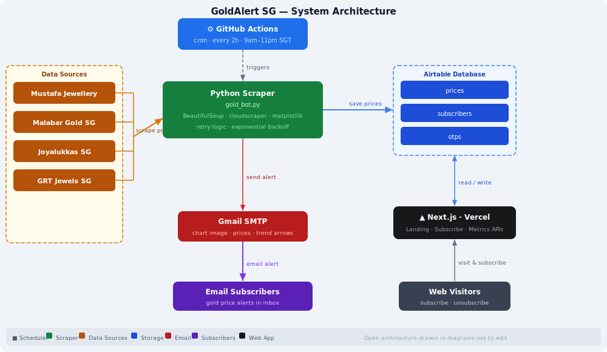

# 🪙 GoldAlert SG — Gold Price Notifier

[](https://nextjs.org)
[](https://www.typescriptlang.org)
[](https://vercel.com)
[](https://python.org)
[](https://github.com/features/actions)
[](https://airtable.com)

> Free, automated gold price monitoring for Singapore. Get instant email alerts when 22k and 24k gold prices change at Mustafa Jewellery.

---

## 🖥 Live UI


---

## ✨ What This Does

Every **2 hours from 9am–11pm SGT**, the system:

1. Scrapes live gold prices from Mustafa Jewellery (22k & 24k)
2. Compares with previous prices — adds ↑ / ↓ trend indicators
3. Sends email alerts to all subscribers via Gmail SMTP
4. Notifies even on scrape failure (with error details)

Subscribers sign up via the **Next.js landing page** hosted on Vercel. Emails are stored in **Airtable**. The scraper runs on **GitHub Actions** — fully serverless, zero infrastructure cost.

---

## 🏗 Architecture



> Open [`docs/architecture.drawio`](docs/architecture.drawio) in [diagrams.net](https://app.diagrams.net) to edit.

---

## 🎨 Frontend — Dark Luxury Gold UI

Built with **Next.js 14 App Router**, pure CSS, and Google Fonts. No UI library dependencies.

| Element | Choice |
|---|---|
| **Display font** | Cormorant Garamond (serif, editorial) |
| **Body font** | Outfit (modern, clean) |
| **Number font** | JetBrains Mono (monospaced, precise) |
| **Gold accent** | `#c8a84b` — real 22k gold hue |
| **Background** | `#070708` near-black |
| **Motion** | Canvas particle system (130 gold dust particles + 7 glow orbs) |

### Page Sections

1. **Announcement bar** — animated gold shimmer · "100% Free for Life — Limited Early Access"
2. **Hero** — live badge, Cormorant headline with shimmer animation, subscribe form, live metrics
3. **Stats band** — 2hr updates · 22k & 24k · 100% free
4. **Features** — 4 cards with gold border glow on hover
5. **Testimonials** — 2-column social proof cards
6. **How It Works** — 3-step process with connector lines
7. **Value Prop** — "Save up to S$350 per 100g" with gold shimmer
8. **CTA** — repeat subscribe form
9. **Footer**

---

## 📁 Project Structure

```
Gold-Notifier-SG/
├── web/                        ← Next.js app (deploy this to Vercel)
│   ├── app/
│   │   ├── globals.css         ← All styles + gold animations
│   │   ├── layout.tsx          ← Root layout with Google Fonts
│   │   ├── page.tsx            ← Landing page (canvas, form, sections)
│   │   └── api/
│   │       ├── subscribe/      ← POST: add subscriber to Airtable
│   │       └── metrics/        ← GET: live subscriber + alert counts
│   ├── .env.local.example      ← Copy to .env.local with your keys
│   └── package.json
├── scraper/
│   ├── gold_bot.py             ← Scraper + email sender (Python)
│   └── requirements.txt
├── .github/
│   └── workflows/goldrates.yml ← GitHub Actions cron scheduler
└── docs/
    └── screenshots/            ← UI screenshots
```

---

## 🚀 Setup

### 1 — Clone

```bash
git clone https://github.com/unaveenj/Gold-Notifier-SG.git
cd Gold-Notifier-SG
```

### 2 — Web App (Next.js → Vercel)

```bash
cd web
npm install

# Copy and fill in your Airtable credentials
cp .env.local.example .env.local
```

`.env.local`:
```
AIRTABLE_API_KEY=your_airtable_personal_access_token
AIRTABLE_BASE_ID=your_airtable_base_id
```

Run locally:
```bash
npm run dev   # http://localhost:3000
```

**Deploy to Vercel:**
1. Import repo at [vercel.com/new](https://vercel.com/new)
2. Set **Root Directory** → `web`
3. Add environment variables: `AIRTABLE_API_KEY`, `AIRTABLE_BASE_ID`
4. Deploy ✓

### 3 — Scraper (Python)

```bash
pip install -r scraper/requirements.txt
```

### 4 — Gmail SMTP

Use a **Google App Password** (not your regular password):

1. Enable **2-Step Verification** on your Google account
2. Go to **Google Account → Security → App Passwords**
3. Generate a password for `Mail / Other`

### 5 — GitHub Secrets

Go to `Repo → Settings → Secrets → Actions`:

| Secret | Description |
|---|---|
| `AIRTABLE_API_KEY` | Airtable personal access token |
| `AIRTABLE_BASE_ID` | Airtable base ID |
| `GMAIL_USER` | Your Gmail address |
| `GMAIL_APP_PASSWORD` | Google App Password (16 chars) |

---

## ⏰ Schedule

Cron in `.github/workflows/goldrates.yml`:

```yaml
"0 1,3,5,7,9,11,13,15 * * *"
# UTC 01:00–15:00 = SGT 09:00–23:00, every 2 hours
```

| UTC | SGT |
|-----|-----|
| 01:00 | 09:00 |
| 03:00 | 11:00 |
| 05:00 | 13:00 |
| 07:00 | 15:00 |
| 09:00 | 17:00 |
| 11:00 | 19:00 |
| 13:00 | 21:00 |
| 15:00 | 23:00 |

---

## 🧠 Reliability

- ✅ Max 3 retry attempts per scrape
- ✅ 10-second total scrape deadline with exponential backoff
- ✅ Numeric price validation
- ✅ Failure email sent even when scrape fails
- ✅ Duplicate subscription protection (Airtable dedup)
- ✅ Live subscriber + alert counts on landing page (60s refresh)
- ✅ Fully serverless — no server to maintain

---

## 📲 Email Format

**On success:**
```
📊 Gold Price Update

22k (916): S$204.40 ↑
24k (999): S$222.00 →

Last updated on source: 22-03-2026 09:17:03 AM
Job run time: 2026-03-22 09:00:02 (SGT)

Status: OK
```

**On failure:**
```
📊 Gold Price Update - STALE

Job run time: 2026-03-22 09:00:02 (SGT)

Status: FAILED
Error: <error details>
```

---

## 🛠 Scraper — Target Elements

```
mustafajewellery.com
  #22k_price1        → 22k (916) price
  #24k_price1        → 24k (999) price
  #date_update_gold  → source last-updated date
  #time_updates_gold → source last-updated time
```

---

## 📈 Roadmap

- [x] Historical price chart in email
- [x] Price threshold alerts (notify only when below X)
- [x] Unsubscribe link in email footer
- [x] Multiple pricing sources — Mustafa, Malabar, Joyalukkas, GRT
- [x] Daily digest option

## 🔜 Coming Soon

- [ ] **Price drop push notifications** — browser push alerts (via Web Push API) so you get notified instantly without waiting for the next email batch
- [ ] **Telegram / WhatsApp bot** — get gold price updates directly in your messaging app, with inline reply buttons to set personal price targets

---

## ⚠ Disclaimer

Scrapes publicly available data for personal monitoring purposes only. Ensure compliance with the target website's terms of service before deploying at scale.

---

## 🧑‍💻 Author

Built as a lightweight serverless automation to help Singapore gold buyers time their purchases.

⭐ Star this repo if you found it useful
